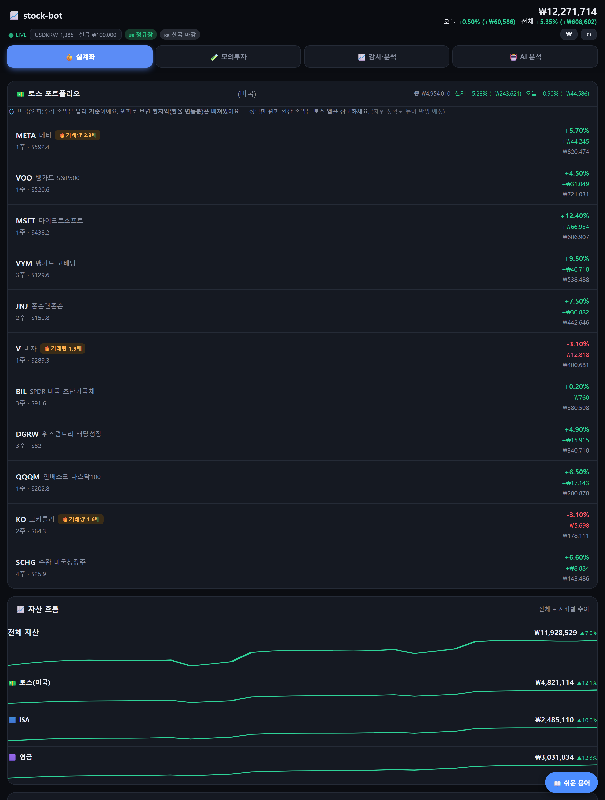

# Susan

**AI Engineer · Backend Developer**

데모로 끝내지 않고, 배포해서 실제로 쓰이는 걸 만듭니다.

 

## About

3년 넘게 금융·헬스케어 도메인에서 백엔드를 만들었습니다. 외부기관 API 연동, 트랜잭션 복구, AWS에서 Azure로 무중단 이전 — 틀리면 안 되는 일들을 주로 맡았어요.

요즘은 그 위에 AI를 얹고 있습니다. RAG와 LLM으로 실제 돌아가는 서비스를 직접 만들어 배포하고, MCP·Agent 쪽으로 조금씩 넓혀가는 중입니다.

가장 좋아하는 건 *모르는 걸 아는 척하지 않는 시스템*이에요. 근거(출처)를 대고, 애매하면 애매하다고 답하는 쪽으로 만듭니다.

 

## Tech Stack

**Languages**

**AI / LLM**

**Backend &amp; Data**

**Frontend**

**Infra**

 

## Projects

### 🐱 고양이 수유 리포트 &nbsp;집 로컬 서버 · 가족이 사용 중

길에서 업어온 젖먹이 고양이를, 수유 한 번 안 해본 초보 집사가 잘 키울 수 있을까 — 그 막막함에서 시작한 앱입니다. 전문 지식이 없어도 AI 안내를 받아 때맞춰 먹이고 위험 신호를 놓치지 않도록 돕고 싶었고, 지금은 집 서버에 올려 가족이 매일 쓰고 있습니다.

수유량과 다음 수유·약 시각을 자동으로 계산하고, 대시보드 신호등으로 지금 상태를 한눈에 보여줍니다. 멀티 LLM(Groq·Mistral·HuggingFace 폴백)과 RAG로 주수별 성장 가이드를 출처와 함께 안내하고, Web Push는 위험 시각이 가까워질수록 더 자주 알립니다. 함께 돌보는 가족은 1회용 초대키로 연결되며, 전체 서비스는 Docker·Caddy·Cloudflare Tunnel 위에서 Jenkins로 자동 배포됩니다.

`React` `TypeScript` `Express` `PostgreSQL` `pgvector` `Web Push` `Docker` `Jenkins`

**[라이브 데모 → cat.chobihome.site/demo](https://cat.chobihome.site/demo)**
 데모는 합성 데이터의 '데모냥이'만 보여줍니다 — 실제 사용자·아이 정보와 격리되고 나가면 초기화됩니다. 직접 로그인: `demo@chobihome.site` / `demo`

 

### 📈 주식 자동매매 비서 (stock-bot) &nbsp;집 로컬 서버 24시간 상주 · 실계좌 연동

<table>
<tr>
<td width="58%" valign="top">

"감이 아니라 근거로 투자하자"에서 시작한 반자동 투자 비서입니다. 봇이 미국·한국 시장을 24시간 지켜보며 분석하고 제안하지만, 실제 매매는 사람이 승인해요. 검증 없이 실돈을 맡기지 않는다는 원칙으로, 모의계좌에서 백테스트·워크포워드·24시간 모의운용까지 충분히 거친 전략만 실계좌 자동매매로 넘어갑니다.

토스(미국)와 한국투자(ISA·연금) 세 계좌를 어댑터 하나로 묶고, 몬테카를로로 "21일 뒤 상승 확률·기대수익"을 예측한 뒤 만기가 지나면 스스로 적중을 채점합니다. FinBERT와 LLM으로 뉴스 감성을 읽고, 주식 초보도 알아듣게 풀어주는 RAG 챗봇이 보유 종목과 계좌 제약을 근거로 답합니다.

`Python` `FastAPI` `PostgreSQL` `Redis` `APScheduler` `FinBERT` `Groq/Mistral` `Docker`

**[라이브 데모 → stock.chobihome.site/demo](https://stock.chobihome.site/demo)**
 데모는 합성 데이터만 보여줍니다 — 실계좌·자산과 완전히 격리됩니다. 직접 로그인 비밀번호: `demo`

</td>
<td width="42%" valign="top">

</td>
</tr>
</table>

 

<table>
<tr>
<td width="50%" valign="top">

### 🏦 다온뱅크

은행에서 흔히 보는 화면을 한 묶음으로 만들어 본 풀스택 프로젝트입니다. 계좌 이체부터 대출 심사, 의심거래 탐지까지 실제로 돌아갑니다. RAG 챗봇이 약관·SOP를 근거로 답하고, 룰·XGBoost·LLM을 엮은 파이프라인이 이상거래를 잡아내며, 대출은 6개 항목을 점수화해 자동 심사합니다.

`FastAPI` `Next.js` `PostgreSQL` `Kafka` `XGBoost`

**[저장소 →](https://github.com/PARK1217/bank-portfolio)**

</td>
<td width="50%" valign="top">

### 📚 RAG Study Platform

업로드한 문서로 학습 챗봇을 만들고, AI가 문제를 내주는 학습 플랫폼입니다. LLM 7종을 런타임에 바꿔가며 비용·속도·품질을 비교하고, Prometheus·Grafana로 호출·토큰을 실시간으로 들여다봅니다.

`Vue 3` `FastAPI` `LangChain` `FAISS` `Grafana`

**[저장소 →](https://github.com/PARK1217/rag-study-platform)**

</td>
</tr>
<tr>
<td width="50%" valign="top">

### 🛰️ Interface Hub

REST·SOAP·MQ·SFTP·Batch 같은 외부 인터페이스를 한 화면에서 등록·감시·분석하는 관제 플랫폼입니다. 설계부터 배포까지 혼자 했어요. WebSocket으로 장애를 실시간으로 알리고, 자연어로 원인을 추적하는 AI 분석을 붙였습니다.

`Vue 3` `TypeScript` `Vuetify` `WebSocket`

**[라이브 →](https://interface-hub.chobihome.site/)**

</td>
<td width="50%" valign="top">

### 🧰 Python Multi-Tool

파이썬 문법을 실무형 웹 도구로 옮겨 본 연습 프로젝트입니다. 비밀번호 보안 검사기와 통계 대시보드를 관심사 분리 구조로 구성했습니다.

`Python` `Streamlit`

**[저장소 →](https://github.com/PARK1217/mini_project)**

</td>
</tr>
</table>

 

## GitHub

  

<a href="mailto:fasosan@gmail.com">fasosan@gmail.com</a>

